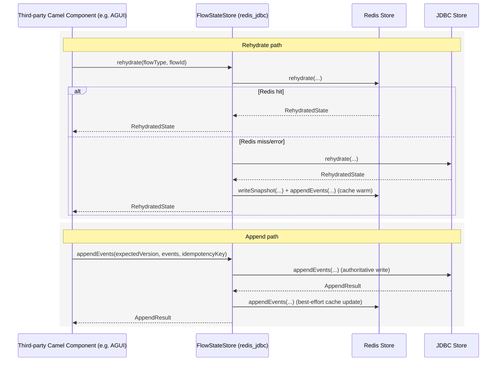

# Third-Party Component Integration Guide

This guide explains how external Camel components (for example, an AGUI component) can integrate with `camel-persistence`.

It covers:

- JDBC-only persistence
- Redis-only persistence
- Combined Redis primary + JDBC fallback/source-of-truth (`redis_jdbc`)

## 1) Integration model

Most third-party components use the same pattern:

1. Build `PersistenceConfiguration` from component/environment properties.
2. Create `FlowStateStore` once during component/service startup.
3. Use `rehydrate` before handling a command.
4. Use `appendEvents` after command decision.
5. Periodically call `writeSnapshot` (or based on policy threshold).

Core APIs:

- `FlowStateStoreFactory.create(configuration)`
- `FlowStateStore.rehydrate(flowType, flowId)`
- `FlowStateStore.appendEvents(...)`
- `FlowStateStore.writeSnapshot(...)`

## 2) Dependencies

Use `core` and one or more backend modules depending on scenario.

### JDBC-only

```xml
<dependency>
  <groupId>io.dscope.camel</groupId>
  <artifactId>camel-persistence-core</artifactId>
  <version>1.1.0</version>
</dependency>
<dependency>
  <groupId>io.dscope.camel</groupId>
  <artifactId>camel-persistence-jdbc</artifactId>
  <version>1.1.0</version>
</dependency>
```

### Redis-only

```xml
<dependency>
  <groupId>io.dscope.camel</groupId>
  <artifactId>camel-persistence-core</artifactId>
  <version>1.1.0</version>
</dependency>
<dependency>
  <groupId>io.dscope.camel</groupId>
  <artifactId>camel-persistence-redis</artifactId>
  <version>1.1.0</version>
</dependency>
```

### Combined Redis+JDBC (`redis_jdbc`)

```xml
<dependency>
  <groupId>io.dscope.camel</groupId>
  <artifactId>camel-persistence-core</artifactId>
  <version>1.1.0</version>
</dependency>
<dependency>
  <groupId>io.dscope.camel</groupId>
  <artifactId>camel-persistence-redis</artifactId>
  <version>1.1.0</version>
</dependency>
<dependency>
  <groupId>io.dscope.camel</groupId>
  <artifactId>camel-persistence-jdbc</artifactId>
  <version>1.1.0</version>
</dependency>
```

## 3) Configuration properties

Common:

- `camel.persistence.enabled`
- `camel.persistence.backend` (`redis`, `jdbc`, `redis_jdbc`, `ic4j`)
- `camel.persistence.snapshot-every-events`
- `camel.persistence.max-replay-events`
- `camel.persistence.read-batch-size`

Redis:

- `camel.persistence.redis.uri`
- `camel.persistence.redis.key-prefix`

JDBC:

- `camel.persistence.jdbc.url`
- `camel.persistence.jdbc.user`
- `camel.persistence.jdbc.password`

## 4) AGUI-style component bootstrap example

```java
import io.dscope.camel.persistence.core.FlowStateStore;
import io.dscope.camel.persistence.core.FlowStateStoreFactory;
import io.dscope.camel.persistence.core.PersistenceConfiguration;

import java.util.Properties;

public final class AguiPersistenceBootstrap {

  public static FlowStateStore createStore(Properties componentProps) {
    PersistenceConfiguration cfg = PersistenceConfiguration.fromProperties(componentProps);
    if (!cfg.enabled()) {
      throw new IllegalStateException("Persistence is disabled");
    }
    return FlowStateStoreFactory.create(cfg);
  }
}
```

## 5) Runtime flow (all scenarios)

Typical command handling loop:

1. `rehydrate(flowType, flowId)` to load current state and tail events.
2. Run decision logic in component/application.
3. `appendEvents(...)` with expected version for optimistic concurrency.
4. Optionally `writeSnapshot(...)` when policy threshold is reached.

## 6) Scenario behavior

### Sequence diagram (`redis_jdbc`)



### A) Redis-only (`backend=redis`)

Best when low-latency is primary requirement and Redis durability setup is acceptable.

Pros:

- fast reads/writes
- simple setup

Trade-offs:

- durability/retention depends on Redis config and ops policy

### B) JDBC-only (`backend=jdbc`)

Best when durability and relational operational model are primary requirements.

Pros:

- strong persistence semantics
- easy DB backup/compliance processes

Trade-offs:

- higher read/write latency than in-memory cache path

### C) Combined (`backend=redis_jdbc`)

Best for fast-path reads with durable fallback.

Current behavior in this library:

- Rehydrate: tries Redis first; on miss/error falls back to JDBC and warms Redis.
- Append: writes JDBC first (source of truth), then updates Redis best-effort.
- Snapshot write: writes JDBC first, then Redis best-effort.
- Read events: tries Redis first; falls back to JDBC when Redis path is empty/error.

Operational recommendation:

- treat JDBC as authoritative history
- treat Redis as performance layer

## 7) Suggested property sets

### JDBC-only

```properties
camel.persistence.enabled=true
camel.persistence.backend=jdbc
camel.persistence.jdbc.url=jdbc:postgresql://db:5432/agui
camel.persistence.jdbc.user=agui
camel.persistence.jdbc.password=secret
```

### Redis-only

```properties
camel.persistence.enabled=true
camel.persistence.backend=redis
camel.persistence.redis.uri=redis://localhost:6379
camel.persistence.redis.key-prefix=agui:state
```

### Combined Redis+JDBC

```properties
camel.persistence.enabled=true
camel.persistence.backend=redis_jdbc
camel.persistence.redis.uri=redis://localhost:6379
camel.persistence.redis.key-prefix=agui:state
camel.persistence.jdbc.url=jdbc:postgresql://db:5432/agui
camel.persistence.jdbc.user=agui
camel.persistence.jdbc.password=secret
```

## 8) Error handling guidance for component authors

- Handle `OptimisticConflictException` by reloading (`rehydrate`) and retrying command decision.
- Treat backend unavailability as retriable infrastructure failure.
- In `redis_jdbc`, Redis failures on cache update should not be treated as write-loss when JDBC append succeeds.

## 9) Testing strategy for third-party components

Minimum recommended tests:

1. optimistic conflict path
2. idempotency key duplicate path
3. snapshot + tail replay correctness
4. `redis_jdbc` fallback path (Redis miss/error -> JDBC success)

## 10) Compatibility note

`camel-persistence` root artifact is a parent POM.
Runtime consumers should depend on concrete modules (`core` + backend modules), not only the parent POM.